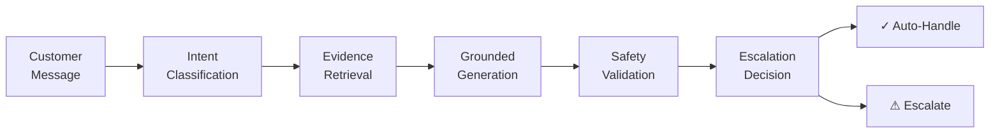
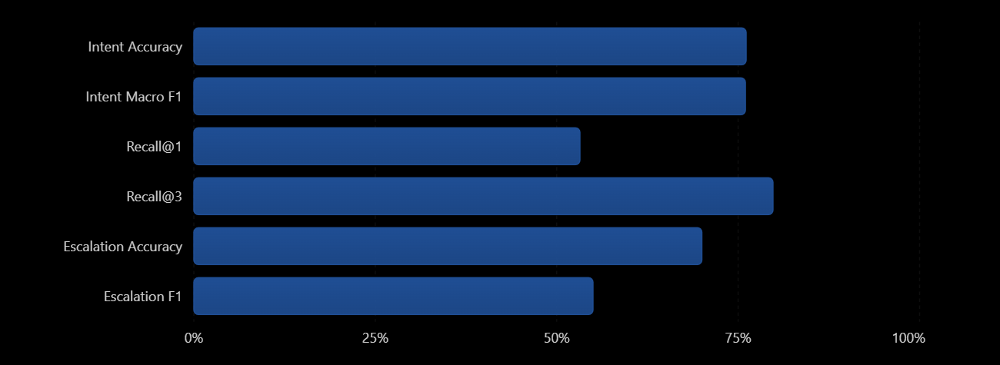

# PlayStation Support Agent

**Grounded AI Customer Support**  
Classify → Retrieve → Generate → Validate → Escalate

<p>
   An auditable AI customer support agent designed to handle customer queries through a complete support pipeline: intent classification, evidence retrieval, grounded response generation, response safety validation, and human escalation. Built with TF-IDF and Logistic Regression for intent classification, similarity-based retrieval over public customer-support data, Gemini for contextual response generation, and Streamlit for an interactive support experience and evaluation dashboard. The system is designed to prioritize grounded answers, transparent decisions, and safe escalation rather than blindly generating responses.
</p>

[](https://www.python.org/)
[](https://scikit-learn.org/)
[](https://ai.google.dev/)
[](https://fastapi.tiangolo.com/)
[](https://streamlit.io/)
[](https://www.sqlite.org/)

---

## ✨ At a Glance

<table width="100%" border="0">
<tr>
<td align="center" width="25%"><b>🧠 Classification</b><br><sub>TF-IDF + Logistic Regression</sub></td>
<td align="center" width="25%"><b>🔎 Retrieval</b><br><sub>Intent-aware TF-IDF</sub></td>
<td align="center" width="25%"><b>🤖 Generation</b><br><sub>Grounded LLM + Fallback</sub></td>
<td align="center" width="25%"><b>🛡️ Safety</b><br><sub>Fail-closed Validation</sub></td>
<td align="center" width="25%"><b>🚨 Escalation</b><br><sub>Confidence + Evidence</sub></td>
</tr>
<tr>
<td align="center"><b>🌐 API</b><br><sub>FastAPI</sub></td>
<td align="center"><b>💻 UI</b><br><sub>Streamlit</sub></td>
<td align="center"><b>🗄️ Database</b><br><sub>SQLite</sub></td>
<td align="center"><b>🧪 Evaluation</b><br><sub>Multi-stage</sub></td>
<td align="center"><b>⚡ Architecture</b><br><sub>Auditable Pipeline</sub></td>
</tr>
</table>

---

## 🔄 How It Works



---

<table width="100%" border="0">
<tr>

<td width="25%" valign="top">

### 📊 Evaluation Snapshot

| Metric              |    Result |
| ------------------- | --------: |
| Intent Accuracy     | **76.1%** |
| Intent Macro F1     | **0.760** |
| Retrieval Recall@1  | **53.2%** |
| Retrieval Recall@3  | **79.8%** |
| Escalation Accuracy | **70.0%** |
| Escalation F1       |  **0.55** |

</td>

<td width="75%" valign="middle">



</td>

</tr>
</table>

---

## 🧠 Intent Classification

The agent first identifies the type of customer issue using **TF-IDF + Logistic Regression**.

It classifies incoming tickets into **9 support intents**:

`account_access` · `billing_payment` · `console_hardware` · `game_software` · `network_connectivity` · `subscription_services` · `refund_cancellation` · `security_compromise` · `out_of_scope`

The classifier is evaluated separately from the training data to measure its ability to generalize to unseen support queries.

**Intent Accuracy:** `76.1%`  
**Macro F1:** `0.760`

---

---

## 🔎 Evidence Retrieval

Once the ticket intent is identified, the agent retrieves relevant historical support conversations from the public **AskPlayStation customer-support dataset**.

The retrieval layer combines **TF-IDF similarity** with **intent-aware filtering** to find the most relevant evidence for the incoming query.

### Retrieval Strategy

```text
Customer Query
      ↓
Intent Context
      ↓
TF-IDF Similarity Search
      ↓
Top-K Relevant Evidence
      ↓
Grounded Response Generation
```

---

---

## 🤖 Grounded Response Generation

The response generator combines the retrieved support evidence with explicit grounding rules to produce a concise customer-facing response.

The system is designed to:

- Use retrieved evidence as the primary context
- Avoid unsupported policies, refunds, or guarantees
- Avoid repeating troubleshooting steps already attempted
- Ask for clarification when available evidence is insufficient
- Keep responses concise and support-oriented
- Fall back to deterministic templates when live generation is unavailable

### Generation Modes

| Mode                | Purpose                              |
| ------------------- | ------------------------------------ |
| **Mock / Template** | Deterministic local fallback         |
| **Live LLM**        | Gemini-powered contextual generation |

---

## 🛡️ Safety & Escalation

Before a response reaches the customer, it passes through a **fail-closed safety layer**.

The system checks for:

- Missing or weak supporting evidence
- Unsupported claims
- Risky or sensitive requests
- Insufficient confidence
- Cases requiring human intervention

If a response fails validation or the case is uncertain, the system does not blindly generate an answer. Instead, it produces an explicit **escalation decision with a reason code**.

```text
Generated Response
        ↓
   Safety Checks
        ↓
   ┌────┴────┐
   ↓         ↓
  Safe     Unsafe /
   ↓       Uncertain
Auto-Handle    ↓
            Escalate
```

---

## 🌐 REST API

The agent is exposed through a lightweight **FastAPI** service for programmatic ticket processing.

| Method | Endpoint        | Purpose                     |
| ------ | --------------- | --------------------------- |
| `GET`  | `/health`       | Check service health        |
| `POST` | `/tickets`      | Submit and process a ticket |
| `GET`  | `/tickets/{id}` | Retrieve a processed ticket |

### Processing Flow

```text
POST /tickets
      ↓
Agent Pipeline
      ↓
Classification → Retrieval → Generation
      ↓
Safety → Escalation
      ↓
Stored Ticket + Decision
```

---

---

## 🖥️ Live Demo

The deployed Streamlit application provides three views:

| View                     | Purpose                                                   |
| ------------------------ | --------------------------------------------------------- |
| **Try the Agent**        | Submit a customer query and inspect the complete decision |
| **Evaluation Dashboard** | Explore system and model evaluation metrics               |
| **What's Next**          | Review limitations and future improvements                |

[](https://playstation-support-agent.streamlit.app/)

---

## 🧪 Evaluation Coverage

The evaluation suite measures the system at multiple stages rather than evaluating only the final response.

| Component                 | Evaluation                      |
| ------------------------- | ------------------------------- |
| **Intent Classification** | Accuracy + Macro F1             |
| **Retrieval**             | Recall@1 + Recall@3             |
| **Response Safety**       | Safety evaluation set           |
| **Escalation**            | Accuracy, Precision, Recall, F1 |
| **End-to-End Agent**      | Pipeline behaviour              |
| **REST API**              | Endpoint tests                  |

### Current Evaluation Set

**188** golden evaluation examples · **9** intent categories · **45** safety examples · **12/12** escalation tests passing

Additional human validation and LLM-as-a-Judge evaluation are planned.

---

## 📁 Project Structure

```text
PlayStation-Support-Agent/
│
├── api/
│   ├── database.py
│   ├── db_models.py
│   ├── dependencies.py
│   ├── main.py
│   └── schemas.py
│
├── src/
│   ├── agent.py
│   ├── classifier.py
│   ├── retrieval.py
│   ├── reply_generator.py
│   ├── safety.py
│   ├── escalation.py
│   ├── llm_providers.py
│   └── evaluation.py
│
├── tests/
├── app.py
├── REPORT.md
├── REVIEW_GUIDE.md
├── decision_log.md
├── requirements.txt
├── .env.example
├── logo.png
└── README.md

```

---

## ⚙️ Setup & Run

````markdown
## ⚙️ Setup & Run

### 1. Clone

```bash
git clone https://github.com/A-verse/PlayStation-Support-Agent.git
cd PlayStation-Support-Agent

2. Create Environment
python -m venv .venv
.venv\Scripts\Activate.ps1
pip install -r requirements.txt

3. Configure Environment
Create a .env file:
LLM_PROVIDER=gemini
GEMINI_API_KEY=your_api_key
REPLY_GEN_MODEL=gemini-3.7-flash

Never commit .env or API keys to the repository.

4. Run the Application
streamlit run app.py

5. Run the API
uvicorn api.main:app --reload

6. Run Tests
pytest -q
```
````

---

## 🧭 Design Principles

<table width="100%" border="0">
<tr>
<td width="20%" align="center"><b>Ground First</b><br><sub>Evidence before generation</sub></td>
<td width="20%" align="center"><b>Fail Closed</b><br><sub>Uncertainty triggers escalation</sub></td>
<td width="20%" align="center"><b>Stay Auditable</b><br><sub>Decisions have explicit reasons</sub></td>
<td width="20%" align="center"><b>Measure Honestly</b><br><sub>Limitations remain visible</sub></td>
<td width="20%" align="center"><b>Build Modularly</b><br><sub>Components evolve independently</sub></td>
</tr>
</table>

---

## 🚧 Known Limitations

- Golden-set human sign-off is pending
- Retrieval human validation is pending
- LLM-as-a-Judge evaluation is pending
- Human-review agreement is currently unavailable
- Hardware-related retrieval needs improvement
- Escalation performance can be improved
- No authentication or rate limiting
- Processing is currently synchronous
- No background queue or retry worker
- No real PlayStation account, order, or payment integration

---

## 🗺️ Roadmap

### 📊 Evaluation

Human golden-set review · Human-review agreement · Retrieval validation · Live LLM quality evaluation · Threshold tuning

### ⚙️ Product

Authentication · Rate limiting · Async processing · Background workers · Human-agent overrides · Production database

### 🧠 Model

Better weak labels · Hardware retrieval improvements · Confidence calibration · Expanded safety evaluation · Alternative retrieval methods

---

## 📚 Documentation

| Document                             | Purpose                                |
| ------------------------------------ | -------------------------------------- |
| [`REPORT.md`](REPORT.md)             | Detailed project report                |
| [`REVIEW_GUIDE.md`](REVIEW_GUIDE.md) | Reviewer walkthrough                   |
| [`decision_log.md`](decision_log.md) | Architecture and engineering decisions |

---

<p align="center">
  <sub>✦</sub> <b>A-verse</b> <sub>✦</sub>
</p>
